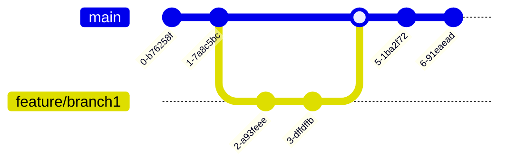

# Contribution guide

This page explains how to report issues and the guidelines for contributing to the project.

## Contribution flow

1. Someone opens an issue to report a bug or propose changes.  
2. Maintainers label issues (e.g., `duplicate`, `blocked`, `needs owner`, `needs info`, `wontfix`, `breaking change`) to help prioritize.  
3. Volunteers express interest in resolving an issue.  
4. Maintainers assign the issue to a responsible contributor.  
5. The assignee submits a pull request with the changes.  
6. Maintainers review and merge approved pull requests.

## Recommended issues for starters

If you’re not familiar with the project, you can start with issues labeled [good first issue](https://github.com/ju4n97/relic/internal/issues?q=is%3Aissue+is%3Aopen+label%3A%22good+first+issue%22+-label%3A%22blocked+by+upstream%22). Before starting, make sure there are no active pull requests or existing assignments.

## Code style

* **Go:** [Revive](https://github.com/mgechev/revive) ([configuration](./revive.toml))  
* **Editor consistency:** [EditorConfig](.editorconfig)

## Git workflow

Trunk-based development is used ([https://trunkbaseddevelopment.com](https://trunkbaseddevelopment.com)):

1. Developers work on short-lived branches created from `main`, integrating changes frequently.  
2. A pull request is created to merge into `main`. At least one maintainer must approve it.  
3. Approved pull requests are merged into `main`, triggering automated workflows.

