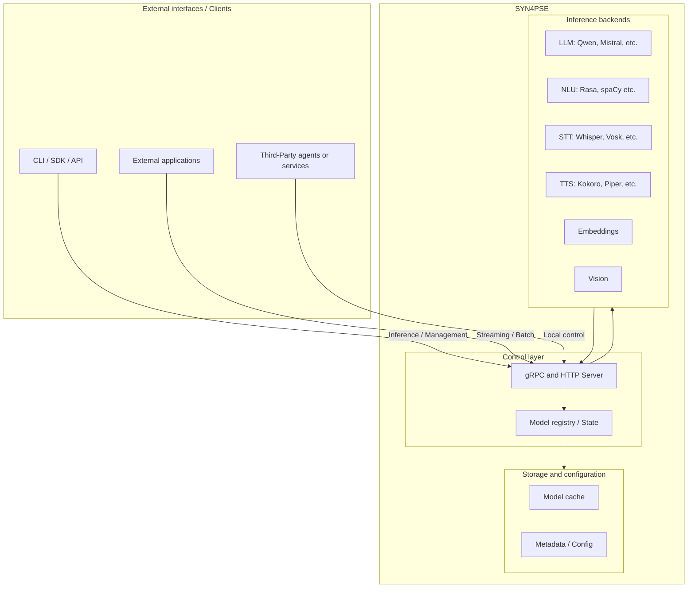

<div align="center">
<pre>
███████╗██╗   ██╗███╗   ██╗██╗  ██╗██████╗ ███████╗███████╗
██╔════╝╚██╗ ██╔╝████╗  ██║██║  ██║██╔══██╗██╔════╝██╔════╝
███████╗ ╚████╔╝ ██╔██╗ ██║███████║██████╔╝███████╗█████╗  
╚════██║  ╚██╔╝  ██║╚██╗██║╚════██║██╔═══╝ ╚════██║██╔══╝  
███████║   ██║   ██║ ╚████║     ██║██║     ███████║███████╗
╚══════╝   ╚═╝   ╚═╝  ╚═══╝     ╚═╝╚═╝     ╚══════╝╚══════╝
</pre>
</div>

[](https://github.com/ju4n97/syn4pse/actions/workflows/ci.yaml)

[](https://goreportcard.com/report/github.com/ju4n97/syn4pse)
[](https://pkg.go.dev/github.com/ju4n97/syn4pse/sdk-go)

> [!IMPORTANT]
> Under development. For now, it only covers the essentials I currently rely on.

# SYN4PSE

SYN4PSE provides a local runtime for running AI models through a unified HTTP and gRPC API.

## Architecture (as of October 2025)



## Supported backends

### LLM

- **[llama.cpp](https://github.com/ggml-org/llama.cpp)**
  - Source: [`backend/llama`](backend/llama)
  - Acceleration: CPU, CUDA 11/12
  - License: MIT
  - Status: 🟢 Supported

---

### STT

- **[whisper.cpp](https://github.com/ggerganov/whisper.cpp)**

  - Source: [`backend/whisper`](backend/whisper)
  - Acceleration: CPU, CUDA 12
  - License: MIT
  - Status: 🟢 Supported

- **[Vosk](https://github.com/alphacep/vosk-api)**
  - License: Apache 2.0
  - Status: 🔴 Planned

---

### NLU

- **[Rasa](https://github.com/RasaHQ/rasa)**
  - License: Apache 2.0
  - Status: 🔴 Planned

---

### VAD

- **[Silero VAD](https://github.com/snakers4/silero-vad)**
  - License: MIT
  - Status: 🔴 Planned

---

### TTS

- **[Piper](https://github.com/rhasspy/piper)**

  - Source: [`backend/piper`](backend/piper)
  - Acceleration: CPU
  - License: MIT
  - Status: 🟡 Experimental

- **[Coqui TTS](https://github.com/coqui-ai/TTS)**
  - License: MPL 2.0
  - Status: 🔴 Planned

---

### Vision

- **[ONNX Runtime + OpenCV](https://github.com/microsoft/onnxruntime)**

  - License: MIT
  - Status: 🔴 Planned

- **[Ultralytics YOLO](https://github.com/ultralytics/ultralytics)**
  - License: AGPL-3.0
  - Status: 🔴 Planned

---

### Embeddings

- **[sentence-transformers](https://github.com/UKPLab/sentence-transformers)**

  - License: Apache 2.0
  - Status: 🔴 Planned

- **[nomic-embed-text](https://github.com/nomic-ai/nomic)**
  - License: Apache 2.0
  - Status: 🔴 Planned

---

**Status legend:**

- 🟢 Supported: tested, stable, and recommended for production.
- 🟡 Experimental: functional but subject to changes, bugs, or limitations.
- 🟠 Development: active integration with features still under construction.
- 🔴 Planned: intended for future implementation (PRs welcome).

## Installation

Docker images available at: <https://ghcr.io/ju4n97/syn4pse>

### CPU

```bash
docker run -p 8080:8080 -p 50051:50051 ghcr.io/ju4n97/syn4pse:latest
```

### NVIDIA GPU

Requires [NVIDIA Container Toolkit](https://docs.nvidia.com/datacenter/cloud-native/container-toolkit/latest/install-guide.html).

```bash
docker run -p 8080:8080 -p 50051:50051 --gpus all ghcr.io/ju4n97/syn4pse:cuda
```

## Configuración

SYN4PSE uses a `syn4pse.yaml` file to define which models to download and which services to expose.

```yaml
# syn4pse.yaml
version: "1"

models:
    llama-cpp-qwen2.5-1.5b-instruct:
        type: llm
        backend: llama.cpp
        source:
            huggingface:
                repo: Qwen/Qwen2.5-1.5B-Instruct-GGUF
                include: ["qwen2.5-1.5b-instruct-q4_k_m.gguf"]

    whisper-cpp-small:
        type: stt
        backend: whisper.cpp
        source:
            huggingface:
                repo: ggerganov/whisper.cpp
                include: ["ggml-small.bin"]
        tags: [multilingual, streaming]

    piper-es-ar-daniela:
        type: tts
        backend: piper
        source:
            huggingface:
                repo: rhasspy/piper-voices
                include: ["es/es_AR/daniela/high/*"]
        tags: [spanish, argentina, high-quality]

services:
    llm:
        models: [llama-cpp-qwen2.5-1.5b-instruct]
    stt:
        models: [whisper-cpp-small]
    tts:
        models: [piper-es-ar-daniela]
```

### Environment variables

| Variable                   | Description                               |
| -------------------------- | ----------------------------------------- |
| `SYN4PSE_ENV`              | Runtime environment (`dev`, `prod`, etc.) |
| `SYN4PSE_SERVER_HTTP_PORT` | HTTP server port                          |
| `SYN4PSE_SERVER_GRPC_PORT` | gRPC server port                          |
| `SYN4PSE_MODELS_PATH`      | Path to models directory                  |
| `SYN4PSE_CONFIG_PATH`      | Path to config file (`syn4pse.yaml`)      |

## Examples

Project examples can be found in the [examples](examples) directory.

### Go examples

- [Basic completion](examples/go-basic-completion)
- [Streaming response](examples/go-streaming-response)
- [Multi-turn conversation](examples/go-multi-turn-conversation)
- [Speech-to-Text](examples/go-speech-to-text)
- [Text-to-Speech](examples/go-text-to-speech)
- [Voice assistant pipeline](examples/go-voice-assistant-pipeline)

## Development

### Requirements

- [Go v1.25+](https://go.dev)
- [CMake v3.22+](https://cmake.org)
- [Docker](https://www.docker.com)
- [Task](https://taskfile.dev)
- [protoc](https://github.com/protocolbuffers/protobuf)

```bash
git clone --recursive https://github.com/ju4n97/syn4pse.git
cd syn4pse

task install
# Build backends (this may take several minutes the first time)
task build-third-party          # CPU
# task build-third-party-cuda   # CUDA
task help
```

[Taskfile.yaml](./Taskfile.yaml) is your guide.

## License

[MIT](LICENSE)
